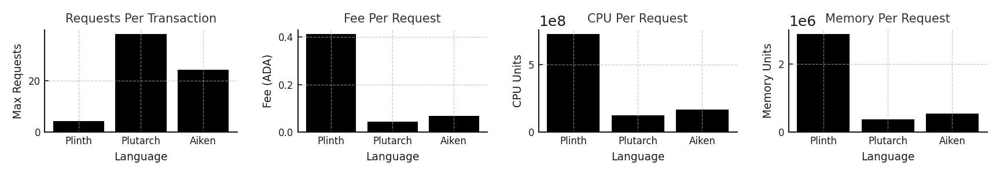
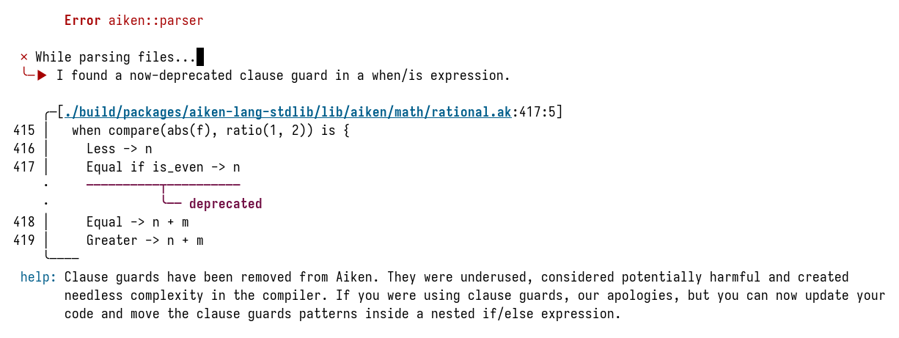

# Production grade code education: Aiken, Plutarch & PlutusTx

## Introduction

In this paper, we present a comparative analysis of three languages used to implement smart contracts on the Cardano blockchain: Plinth (an evolution of PlutusTx), Plutarch, and Aiken. Each contract was written to perform the same request parsing logic derived from the WingRiders V1 protocol. We evaluate their performance in terms of request throughput, transaction fees, memory usage, and CPU consumption, and we assess their respective developer experience, tooling support, and code ergonomics.

The results demonstrate that Plutarch offers the highest execution efficiency across all metrics, making it particularly well-suited for performance-critical applications. Aiken provides a significantly more approachable and expressive development experience tailored for smart contract authors. Plinth maintains the closest alignment with traditional Haskell workflows, offering deep integration with the Haskell toolchain and flexibility for teams already embedded in that ecosystem.

Each language presents a distinct trade-off between control, expressiveness, and optimization. This paper aims to assist developers and teams in selecting the most appropriate language for their specific project goals, whether those involve minimizing on-chain costs, maximizing developer velocity, or aligning with existing infrastructure.

This document assumes that the reader is at least somewhat familiar with Plinth, Plutarch, and Aiken.

## Methodology

All three contracts implement an identical subset of the WingRiders V1 request parsing logic. The implementations are intentionally simplified to isolate the cost and structural characteristics of each language. Validation complexity and functional scope were held constant to ensure a fair comparison of performance metrics.

## Contracts overview

This repository includes a simplified version of the WingRiders V1 request parsing logic implemented in Plinth, Plutarch, and Aiken. There are two contracts:
- a pool validator to batch and apply requests,
- and a request validator to represent a user decision

### Request

The request validator depends on a compile-time parameter: the pool script hash to verify a pool utxo.

The datum holds the following:
- beneficiary address
- owner address
- deadline
- currency symbol
- token name of the pool's assets A and B
- the request action

The request action can be either:
- a swap with a direction (a->b or b->a) and min wanted tokens
- an add liquidity with min wanted shares
- a withdraw liquidity with min wanted a and b
- an extract treasury
- an add staking rewards.

The redeemer is either:
- an apply with an index to the pool input
- or a reclaim

Validation is split into two cases: application and reclamation. The reclamation allows spending the request output if the transaction is signed by the owner of the request. The application checks if the output at the passed index is a script utxo that has the pool hash. The request logic is nearly identical to what WingRiders V1 contracts implement.

### Pool

The pool validator depends on a compile-time parameters:
- a validity currency symbol - to calculate the shares token name
- a staking rewards token currency symbol - to validate staking rewards addition
- an enforced script output datum hash - for compensations with script addresses
- a treasury holder script hash - for the treasury extraction requests

The pool datum holds the following:
- the request script hash
- the currency symbols and token names of the assets A and B

The redeemer is an evolve with a list of indices into the request utxos on the transaction inputs.

The validation allows spending a pool utxo in the following case:
- the transaction's valid range bounds are finite
- the passed request indices don't contain duplicates
- there's at least one passed in request index
- for each passed request index:
  - there is an input at that index
  - the input has a request datum
  - the input has a request script hash address
  - the upper range limit of the transaction must be before the request deadline
  - the request must have the same assets as the pool
  - if the request's action is add staking rewards, the request input has a rewards token
  - there is a compensation output utxo at the passed request index - 1
  - the compensation address must be the request beneficiary
  - if the request action is extract treasury, the beneficiary must be the treasury script
  - if the request beneficiary is a script, the compensation datum must be the enforced script output datum hash
  - if the request action is add staking rewards, the request and the compensation must have a rewards token

Note that the validation only represents a standalone subset of the DEX validation that has to do with parsing the requests out, a huge part of what has to happen to validate interactions is deliberately left out to maximally reduce the code surface required to comfortably comprehend the validation while still preserving something non-trivial.

### A note on input indices

If you've done any Cardano smart contracts work you might notice that the validators require indices of other inputs to be passed, and since Cardano users don't control the placements of inputs, transaction building becomes tricky. What we *do* know as Cardano users is that the inputs are sorted lexicographically, first by their transaction id, then by their output index. We can exploit this knowledge to simplify the testing by creating the pool and the requests in the same transaction, this way they have the same transaction id and are ordered by the output indices. For example, here's how we do that in the deployment scripts:

```typescript
let tx = new Transaction({ initiator: wallet }).sendLovelace(
  { address: poolAddress, datum: { value: poolDatum, inline: true } },
  "2000000",
);

const requests: { txIndex: number }[] = [];
for (let i = 0; i < requestCount; i++) {
  tx = tx.sendLovelace(
    {
      address: requestAddress,
      datum: { value: requestDatum, inline: true },
    },
    "6000000",
  );
  requests.push({ txIndex: i + 1 });
}

const unsignedTx = await tx.build();
```

In a production setting, there has to be a more robust approach: the transaction inputs need to be sorted by the application to determine the correct indices.

## Number of requests, fees, and units

### Plinth

| #Requests | Tx hash                                                          | Total fee | Total mem | Total cpu  |
|-----------|------------------------------------------------------------------|-----------|-----------|------------|
| 1         | e712d3e68556e1dfb3d3a86ee64dbd765bedaebd265ca612840a302603c5c8e2 | 0.953627  | 2547196   | 639934760  |
| 2         | 036ec458ba9ba6ae873941246a912223d4cc1af3c24c811e18280ccaad6545d4 | 1.134692  | 4880188   | 1226790774 |
| 4         | 7511201af041f9579ba67469740e8d1754b5e8e1fb1fbfb55e519f531c0ed83c | 1.643394  | 11470607  | 2893430270 |

Plinth maximally supports the application of 4 requests in one transaction.

### Plutarch

| #Requests | Tx hash                                                          | Total fee | Total mem | Total cpu  |
|-----------|------------------------------------------------------------------|-----------|-----------|------------|
| 1         | 28322f49db7c6c90c29ffe06bd5414127f036b5ad76e943389ba9f7ead8e8399 | 0.343575  | 297667    | 100528395  |
| 2         | f1180270fe841dad872fef46fd93e10f8d634ab0b20e2d0264458014239539a0 | 0.367277  | 538398    | 180440285  |
| 4         | 19a54912f51b9bf2fd3616911767aa016ca3a7fcac64ad1560fc4275674af8e9 | 0.416374  | 1039455   | 348071354  |
| 10        | 07e90862c39548bc7bc973b18212ab2c1040120ae137617e7d44bc1719a8a1f9 | 0.577211  | 2699390   | 913422869  |
| 20        | 0d983bab4a302efc16fa28be3ce2f819627bc2dd2957d16e3298aba09b7ce87a | 0.890437  | 5988493   | 2063869755 |
| 30        | 86a5c6567b5c2f9f3e060c5aa9c843a3df98e482f48ab677141fb6b5d7da0e29 | 1.26117   | 9930776   | 3474559590 |
| 38        | cb2b5cef07a3f6ec31de8c9fccf31e67254573e3e582f2883fc5ea29c4dc3dc7 | 1.59879   | 13554892  | 4609188277 |

Plutarch maximally supports the application of 38 requests in one transaction.

### Aiken

| #Requests | Tx hash                                                          | Total fee | Total mem | Total cpu  |
|-----------|------------------------------------------------------------------|-----------|-----------|------------|
| 1         | 9265f197826b710af260100884428286a7062cd2980013d46780c89310fe6daf | 0.526467  | 552087    | 183533061  |
| 2         | e4b00e4034876df06d4b1471a10b47d9cbf6a93d448ef178b712091a9dad3bf8 | 0.566483  | 997751    | 324510006  |
| 4         | c63da4ce0bbb4c16c2eebb6c61d2515d8f5e6b519fa0ffe4f67ef7e0eb692fe6 | 0.648135  | 1909531   | 612572791  |
| 10        | 95a49f7cbd3d868303cd90c409bd929066e2c4877ff34b49508550be3a490c6c | 0.906058  | 4808500   | 1525632296 |
| 20        | a320d86221ae74da20efd0cf88e2e394b1e78c4f80e2f526552b239d37e477c2 | 1.379147  | 10185539  | 3210301979 |
| 24        | f39fdfdfccc08ddaebdad711d5f1d4580c58172638e97c1f232d1d6c5daae7e1 | 1.583771  | 12527253  | 3941186197 |

Aiken maximally supports the application of 24 requests in one transaction.

### Analysis

Plinth supports only 4 requests per transaction. For the same cost, Plutarch can handle ~38 requests, and Aiken can handle ~24 requests. This means Plutarch is roughly 9.5 times more efficient than Plinth, and Aiken is about 6 times more efficient.



Maximum requests per transaction:
- Plinth: 4 requests
- Plutarch: 38 requests (9.5 times more than Plinth)
- Aiken: 24 requests (6 times more than Plinth)

Fee efficiency:
| Language | Max Requests | Total Fee | Fee per Request |
|----------|--------------|-----------|-----------------|
| Plinth   | 4            | 1.643394  | 0.41085         |
| Plutarch | 38           | 1.59879   | 0.04207         |
| Aiken    | 24           | 1.583771  | 0.06599         |

- Plutarch is ~10 times cheaper per request than Plinth.
- Aiken is ~6 times cheaper per request than Plinth.
- Plutarch is ~36% cheaper per request than Aiken.

CPU efficiency:
| Language | Max Requests | Total CPU     | CPU per Request |
|----------|--------------|---------------|-----------------|
| Plinth   | 4            | 2,893,430,270 | 723,357,567     |
| Plutarch | 38           | 4,609,188,277 | 121,294,427     |
| Aiken    | 24           | 3,941,186,197 | 164,216,091     |

- Plutarch is ~6 times more CPU-efficient than Plinth.
- Aiken is ~4.4 times more CPU-efficient than Plinth.
- Plutarch is ~26% more CPU-efficient than Aiken.

Memory efficiency:
| Language | Max Requests | Total Memory | Memory per Request |
|----------|--------------|--------------|--------------------|
| Plinth   | 4            | 11,470,607   | 2,867,652          |
| Plutarch | 38           | 13,554,892   | 356,708            |
| Aiken    | 24           | 12,527,253   | 521,969            |

- Plutarch is ~8 times more memory-efficient than Plinth.
- Aiken is ~5.5 times more memory-efficient than Plinth.
- Plutarch is ~32% more memory-efficient than Aiken.

### Key Takeaways

- Plutarch is the most efficient option, followed by Aiken, with Plinth being the least efficient by far.
- Plutarch handles 9.5 times more requests per transaction than Plinth while using:
   - ~10 times less fee per request
   - ~6 times less CPU per request
   - ~8 times less memory per request
- Aiken is 6 times better than Plinth in request handling and is also significantly more efficient in fees, CPU, and memory, but Plutarch still outperforms it.
- Between Plutarch and Aiken, Plutarch saves:
   - ~36% on fees
   - ~26% on CPU
   - ~32% on memory

If you're optimizing for cost and efficiency, Plutarch is the best choice.
If you're prioritizing ease of writing and exporting, you might consider using Aiken instead.

## Thoughts on Plinth

Plinth is an update to PlutusTx, the modules still have PlutusTx in the names which is a good thing if you have older code you want to update.

It feels pretty much like Haskell, but a bit uglier since you need INLINEABLE annotations littered throughout the code and you need a plethora of extensions, but that part is like any other Haskell program. The code is simple and concise, and you can use whatever Haskell constructs and tools you want (HLS, cabal, TemplateHaskell, and so on). Still, you need to be aware that some fundamental things work differently: bindings are strict by default and there is no list fusion. That can take a bit of getting used to coming from Haskell, since now your `filter p . map f` idioms will need to be fused manually to avoid traversing the list twice.

The exporting utilities with blueprints are powerful, albeit type-level machinery gives confusing errors at times if you happen to make a mistake. For example, Plinth provides two different ways to derive IsData with constructor indices: makeIsDataIndexed and makeIsDataSchemaIndexed. If you happen to use the first one, all your contract code works and compiles the same, but you get a compilation error for the blueprints (PoolConfig for example):
```
app/Blueprints.hs:160:33: error: [GHC-39999]
    • No instance for ‘HasBlueprintSchema
                         PoolConfig
                         [PoolConfig, Value.CurrencySymbol, DatumHash,
                          PlutusTx.Builtins.Internal.BuiltinByteString, ScriptHash,
                          PoolRedeemer, Integer, [Integer], RequestConfig, RequestRedeemer]’
        arising from a use of ‘deriveDefinitions’
    • In the ‘contractDefinitions’ field of a record
      In the expression:
        MkContractBlueprint
          {contractId = Just "parsing-education",
           contractPreamble = preamble,
           contractValidators = Set.fromList
                                  [poolValidator, requestValidator],
           contractDefinitions = deriveDefinitions
                                   @[PoolConfig, PoolRedeemer, RequestConfig, RequestRedeemer]}
      In an equation for ‘contractBlueprint’:
          contractBlueprint
            = MkContractBlueprint
                {contractId = Just "parsing-education",
                 contractPreamble = preamble,
                 contractValidators = Set.fromList
                                        [poolValidator, requestValidator],
                 contractDefinitions = deriveDefinitions
                                         @[PoolConfig,
                                           PoolRedeemer,
                                           RequestConfig,
                                           RequestRedeemer]}
    |
160 |         , contractDefinitions = deriveDefinitions @[PoolConfig, PoolRedeemer, RequestConfig, RequestRedeemer]
    |                                 ^^^^^^^^^^^^^^^^^
Error: [Cabal-7125]
Failed to build exe:blueprints from parsing-education-0.1.0.0.
```
Now, the error states pretty explicitly that the PoolConfig doesn't have a HasBlueprintSchema type class instance. However, I as a user have no idea that the problem I have is that I used the wrong deriving machinery, which happens to also work just the same unless I want blueprint exporting.

The way you control the Plinth compiler is with GHC plugin options, for example, you can provide `-fplugit-opt PlutusTx.Plugin:target-version=1.0.0` if you want to compile down to 1.0.0 instead of the default 1.1.0. For me as a user that seems confusing. You still need to provide the target version when you lift some Haskell value at runtime, like when you apply a configuration for example:
```haskell
requestValidatorScript ::
    RequestConfig ->
    CompiledCode (BuiltinData -> BuiltinUnit)
requestValidatorScript requestConfig =
    $$(compile [||requestUntypedValidator||]) `unsafeApplyCode` liftCodeDef requestConfig
```
What that means is that you have an additional place you need to track. Nothing stops you from providing a wrong version if you happen to use `liftCode` instead of `liftCodeDef`:
```haskell
requestValidatorScript ::
    RequestConfig ->
    CompiledCode (BuiltinData -> BuiltinUnit)
requestValidatorScript requestConfig =
    $$(compile [||requestUntypedValidator||]) `unsafeApplyCode` liftCode PlutusCore.Version.plcVersion100 requestConfig
```
That's precisely what we did when porting the contracts.

Also, you may have noticed that the request validator script is a `CompiledCode (BuiltinData -> BuiltinUnit)` function. It looks this way because in PlutusV3 that's how your validator is supposed to look like. You need to know this and there's no compiler enforcement that it's actually correct. Nothing stops you from having your validator be of a `CompiledCode (BuiltinData -> BuiltinData -> BuiltinData -> BuiltinUnit)` type like you would have it in PlutusV2. While that is something you're going to discover with the first validation on testnet, discovering that at compile time would have saved you some time.

Plinth also provides you with a few different options for tracing. There's `remove-trace` which eliminates all calls to the `trace` built-in. You'd think that if you don't provide it your contracts will emit traces, but to make sure the optimizer doesn't throw your tracing away you also need to supply `preserve-logging`. Otherwise, you'll be staring at the "the validator crashed/exited prematurely" message and questioning if you're actually testing the right contracts.

Unit testing Plinth is fairly straightforward since it's just Haskell with some weird extensions. You can use the usual HUnit. Having more involved tests with full script validation is harder since you need to construct the transaction context by hand and it might not uphold all relevant transaction invariants. If you use an old enough version, you can get away with using `plutus-apps`, but it's been discontinued so your mileage may vary. There's a new library called `clb` which is the current recommendation instead.

## Thoughts on Plutarch
 
Plutarch is a Domain-Specific Language that allows you to construct Plutus Terms as data structures in Haskell. There are pros and cons to that approach: your code gets noisy with all the `#` and `:-->` and `Term`, but you get precise control over what happens at runtime. For example, since Haskell is now the macro language, you can control whether a function compiled to a hoisted Plutus function, to a Plutus function that is always inlined with its definition, or you can force it to be pasted into the compiled code as a part of the syntax tree without any additional lambda constructs.

For example, it would probably make sense for you to have a function that checks whether an address is a script address. And you probably run it a few times in the code, so you would make it look like this:
```haskell
pisScriptAddress :: Term s (PAddress :--> PBool)
pisScriptAddress = phoistAcyclic $ plam $ \addr -> unTermCont $ do
    address <- pmatchC addr
    pure $ pmatch address.paddress'credential $ \case
        PScriptCredential _ -> pconstant True
        _else -> pconstant False
```

You make a reasonable choice of prioritizing space here, the code will be included in the compiled artifact once and bound to a variable that will be applied with arguments when needed.

But you also have an option to unroll the function body completely:
```haskell
pisScriptAddress :: Term s PAddress -> Term s PBool
pisScriptAddress addr = unTermCont $ do
    address <- pmatchC addr
    pure $ pmatch address.paddress'credential $ \case
        PScriptCredential _ -> pconstant True
        _else -> pconstant False
```
This will make the script size go up if it's used more than once, but you will save CPU cycles. Plutarch grants you this choice and this is something you can't do in Plinth nor Aiken. Having precise control is the main idea behind Plutarch.

Now, this `pisScriptAddress` is harder to read than the Plinth version of the same function:
```haskell
{-# INLINEABLE isScriptAddress #-}
isScriptAddress :: Address -> Bool
isScriptAddress addr = case addressCredential addr of
    ScriptCredential _ -> True
    PubKeyCredential _ -> False
```

The visual complexity of the code increases yet more if you compare recursive functions, like our zip that throws an error if the first list is exhausted before the second:

```haskell
-- Plutarch
pzip' ::
    (PElemConstraint PList a, PElemConstraint PBuiltinList b) =>
    Term s (PList a :--> PBuiltinList b :--> PList (PPair a b))
pzip' = phoistAcyclic $ pfix #$ plam $ \recur la lb ->
    pelimList
        ( \x xs ->
            pelimList
                (\y ys -> pcons # pcon (PPair x y) # (recur # xs # ys))
                -- Each element from the first list must have a corresponding element
                (ptraceInfoError "zip")
                lb
        )
        -- We allow leftovers in the second list
        pnil
        la

-- Plinth
{-# INLINEABLE zip' #-}
zip' :: [a] -> [b] -> [(a, b)]
zip' [] _bs = [] -- second list may have leftovers. This is OK
zip' _as [] = traceError "zip"
zip' (a : as) (b : bs) = (a, b) : zip' as bs
```

Additional things Plutarch lets you tweak is the representation of your types at runtime. Transaction datums, values, and context are represented with Data encoding. Working with it is slow generally speaking as you need to perform a lot of operations to do anything with it. A popular alternative is a recent Sums of Products encoding which is what both Plinth and Aiken use for 1.1.0 Plutus scripts. Plinth also uses Scott encoding for 1.0.0 Plutus scripts, and that's what is used in older Aiken compilers. Plutarch, on the other hand, gives you the ability to choose representation (with the pool redeemer as an example):
```haskell
newtype PPoolRedeemer (s :: S) = PEvolve (Term s (PAsData (PBuiltinList (PAsData PInteger))))
    deriving stock (Generic)
    deriving anyclass (SOP.Generic, PIsData)
    -- Data encoding since it's a redeemer
    deriving (PlutusType) via (DeriveAsDataStruct PPoolRedeemer)

newtype PPoolRedeemer (s :: S) = PEvolve (Term s (PBuiltinList (PAsData PInteger)))
    deriving stock (Generic)
    deriving anyclass (SOP.Generic, PIsData)
    -- We can also use Scott encoding
    deriving (PlutusType) via (DeriveAsScottStruct PPoolRedeemer)

newtype PPoolRedeemer (s :: S) = PEvolve (Term s (PBuiltinList (PAsData PInteger)))
    deriving stock (Generic)
    deriving anyclass (SOP.Generic, PIsData)
    -- We can also use Sums of Products encoding
    deriving (PlutusType) via (DeriveAsSOPStruct PPoolRedeemer)
```
You probably want to use Data encoding for the datums and redeemers and SoP encoding for everything else, but you may find that some specific use-case is better served by a different choice, and you can make that decision as a developer. If you want to learn more the different encoding options, the SoP CIP is a great place to start: https://cips.cardano.org/cip/CIP-85

Let's take a look at the top-level request validator:
```haskell
requestValidator :: Term s (PRequestConfig :--> PData :--> PUnit)
requestValidator = plam $ \config context ->
    perrorIfFalse
        #$ plet (punsafeCoerce @PScriptContext context)
        $ \ctx -> pmatch ctx $
            \c -> pmatch c.pscriptContext'scriptInfo $ \case
                PSpendingScript _outref maybeDatum -> pmatch maybeDatum $ \case
                    PDJust datum ->
                        let d = punsafeCoerce @PRequestDatum datum
                            r = punsafeCoerce @PRequestRedeemer c.pscriptContext'redeemer
                         in prequestScriptValidator config d r ctx
                    _else -> ptraceInfoError "nodatum"
                _else -> ptraceInfoError "invalidinfo"
```
Plutarch has the same problem as Plinth: the V3 validator type is a `Term s (PData :--> PUnit)` and you just need to know that. Again, there's nothing stopping you from having it a `Term s (PData :--> PData :--> PData :--> PUnit)`.

The compilation is done with a `compile` function and you have two options to tweak: the logging info and to what extent you want the logs included. However, Plutarch by itself doesn't provide anything to export the compiled scripts. You can reuse the exporting machinery from Plinth since both are just Haskell libraries, and that seems to be the preferred community recommendation for CIP-0057 compliant exporting.

Unit testing Plutarch is a bit more involved than testing Plinth as you need a touch of additional machinery to support HUnit-style testing. For example, here's a part of what we had to implement in this repository:
```haskell
-- | Like `shouldBe` but for Plutarch terms
pshouldBe :: HasCallStack => ClosedTerm a -> ClosedTerm b -> Assertion
pshouldBe x y = do
    p1 <- eval (comp x)
    p2 <- eval (comp y)
    printScript p1 @?= printScript p2
  where
    eval :: Script -> IO Script
    eval s = case evalScript s of
        (Left e, _, traces) -> assertFailure (prettyLogsWithError "Term evaluation failed:" (show e) traces)
        (Right x', _, _) -> pure x'

-- | Like `@?=` but for Plutarch terms
(#@?=) :: HasCallStack => ClosedTerm a -> ClosedTerm b -> Assertion
(#@?=) = pshouldBe
infix 4 #@?=
```

After that tests aren't that different from what you usually have in Haskell, apart from you having to provide the compiler with a lot of type annotations and lifting code:
```haskell
testCase "paddressPubKeyCredentialAsData on a pub key address" $
  Util.paddressPubKeyCredentialAsData # pconstant (Address (PubKeyCredential "deadbeef") Nothing)
  #@?= pconstant @(PAsData PPubKeyHash) "deadbeef"
```

Again, if you want some transaction-level tests, you may successfully use a now-deprecated `plutus-simple-model` library, or try a newer one called `clb`.

It is important to note that Plutarch is unstable and is still trying to figure out the best way to bridge the Plutus and the Haskell worlds. For example, a [recently merged PR](https://github.com/Plutonomicon/plutarch-plutus/pull/805) breaks the API of the V3 standard library types without changing the underlying behavior. So if you're updating an older contract you will be rewriting a lot of code just to conform to the new way of doing things. The same PR pretty much discontinues the `PTryFrom` type class which is mainly used to make sure a piece of `PData` conforms to some sort of shape, that's useful for parsing Datums for example, and there doesn't seem to be a viable generic alternative yet.

## Thoughts on Aiken

Aiken is the only specialized language in this comparison. To use it you need an Aiken compiler which you're advised to install with an `aikup` CLI tool. This has a huge benefit of allowing Contract-specific solutions embedded in the language design itself. For example, the language embeds a syntactic construct that allows you to check all of the conditions without all the `&&` littering the code:
```aiken
and {
  condition1?,
  condition2
}
```
Additionally, you have specialized syntax to embed tracing your conditions: just add a `?` after a boolean expression.

The language comes with no-effort exporting: you just run `aiken build`. However, parameter application is a bit more involved. As Aiken doesn't have any meta-language inside of it, you need to do everything either with `aiked blueprint apply` which gets tedious if your configuration is at least somewhat stable, or to offload it to a different application altogether.

Unfortunately, the tooling is immature and the language is still not stable. For example, clause guards were removed from the language (the compiler message says "deprecated", but it's a hard compilation error), and even though your code might not be using them, the standard library still did, giving you this beautiful error message on a newer version:

Notice how the compiler gently advises you to update *your code* even though you didn't write it.

Let's take a look at the top-level request contract function:
```aiken
validator request(request_config: RequestConfig) {
  spend(
    datum: Option<Data>,
    redeemer: Data,
    _ref: OutputReference,
    transaction: Transaction,
  ) {
    expect Some(datum_some) = datum
    expect request_datum: RequestDatum = datum_some
    expect request_redeemer: RequestRedeemer = redeemer
    when request_redeemer is {
      Apply { pool_index } ->
        validate_apply(request_config, transaction, pool_index)?
      Reclaim -> validate_reclaim(request_datum, transaction)?
    }
  }

  else(_) {
    fail
  }
}
```
You might notice a huge difference compared to the definitions from Plutarch and Plinth: you define a `validator` with `spend` and `else` functions, not a generic `CompiledCode (BuiltinData -> BuiltinUnit)` or `Term s (DPada :--> PUnit)`. Also, Aiken parses out the parts of the transaction context and switches on the script purpose for you: there's no way *you as a developer* can write it wrong here.

Now, there's a downside to this because you lose some control over what happens, and Aiken doesn't support V1/V2 validators, you need to downgrade the compiler to be able to target older Plutus versions. If you need to interoperate with existing long-living contracts, that's a deal-breaker. Also, Aiken encodes all types with the SoP encoding, and you can't tweak that.

Unit testing is embedded as a language construct and you can interlay the tests and the implementation freely. Here's an example of how an address pub key credential test looks like:
```aiken
test address_pub_key_credential_on_a_pub_key_address() {
  utils.address_pub_key_credential(Address(VerificationKey("deadbeef"), None)) == "deadbeef"
}
```
There's support for property-based fuzzy testing, but for integration-level tests, you'd have to use something other than Aiken.

## Comparisons

Let's start with script sizes.
```sh
jq ".validators[0].compiledCode" -r < plutus.json | wc
```

For Plinth we get the following numbers:
- 13797 for the pool
- 12585 for the request

For Plutarch we get the following numbers:
- 5163 for the pool
- 1161 for the request

For Aiken:
- 9195 for the pool
- 4499 for the request

Plutarch is clearly the winner here, and Aiken firmly stands second. The same is reflected in the maximum number of requests it's possible to process in one transaction: 38 for Plutarch, 4 for Plinth, and 24 for Aiken.

The ranking is unsurprising considering the level of abstraction the languages offer you, however, it *is* surprising just how wide the divide between Plutarch and Plinth is.

Let's examine a few transactions in detail:

* Plinth 1 request: 
https://preprod.cardanoscan.io/transaction/e712d3e68556e1dfb3d3a86ee64dbd765bedaebd265ca612840a302603c5c8e2

The first input is a pool, the second input is a request, the first output is a pool, the second output is a compensation, and the third output is a change output.
The pool contract spends `1_363_863` MEM and `339_513_103` CPU, and the only request spends `1_183_333` MEM and `300_421_657` CPU. The whole transaction costs 0.953627 Ada.

* Plinth 2 requests:
https://preprod.cardanoscan.io/transaction/036ec458ba9ba6ae873941246a912223d4cc1af3c24c811e18280ccaad6545d4

The first input is a pool, the second and third inputs are requests, the first output is a pool, the second and third outputs are compensations, and the last output is change.
The pool contract spends `1_880_080` MEM and `463_316_872` CPU, and both requests spend `1_500_054` MEM and `381_736_951` CPU. The whole transaction costs 1.134692 Ada.

* Plinth 4 requests:
https://preprod.cardanoscan.io/transaction/7511201af041f9579ba67469740e8d1754b5e8e1fb1fbfb55e519f531c0ed83c

The structure remains the same, the pool spends `2_936_623` MEM and `715_960_118` CPU, and all requests spend `2_133_496` MEM and `544_367_538` CPU.

While it's a good thing that requests share the same execution costs in one transaction, it might be surprising that they're not constant among different transactions. After all, the requests just need to look at the first input of the transaction! This stems from the design choice of how Plinth parses and represents data, let's take a look at the untyped top-level request function:
```haskell
{-# INLINEABLE requestUntypedValidator #-}
requestUntypedValidator ::
    RequestConfig ->
    BuiltinData ->
    BuiltinData ->
    BuiltinUnit
requestUntypedValidator requestConfig _ ctx =
    check
        ( case unsafeFromBuiltinData ctx of
            context@(ScriptContext ~_txInfo (Redeemer redeemer) (SpendingScript ~_ (Just (Datum datum)))) ->
                requestTypedValidator
                    requestConfig
                    (unsafeFromBuiltinData datum)
                    (unsafeFromBuiltinData redeemer)
                    context
            _else -> traceError "nodatum"
        )
```

It might not seem like it, but `unsafeFromBuiltinData` traverses the whole `BuiltinData` and parses it into a SoP `ScriptContext` type for you to use! How thoughtful! To circumvent this in a production setting you would want to use `asRawData` and then carefully extract the things you need.

Let's take a look at the Aiken version, the structure follows the same shape:

* Aiken 1 request:
https://preprod.cardanoscan.io/transaction/9265f197826b710af260100884428286a7062cd2980013d46780c89310fe6daf

The pool spends `419_292` MEM and `142_743_536` CPU, and the request spends `132_795` MEM and `40_789_525` CPU, the fee is 0.526467 Ada.

* Aiken 2 requests:
https://preprod.cardanoscan.io/transaction/e4b00e4034876df06d4b1471a10b47d9cbf6a93d448ef178b712091a9dad3bf8

The pool spends `732_161` MEM and `242_930_956` CPU, and the requests spend `132_795` MEM and `40_789_525` CPU each, the fee is 0.566483 Ada.

* Aiken 4 requests:
https://preprod.cardanoscan.io/transaction/c63da4ce0bbb4c16c2eebb6c61d2515d8f5e6b519fa0ffe4f67ef7e0eb692fe6

The pool spends `1_378_351` MEM and `449_414_691` CPU, and the requests spend `132_795` MEM and `40_789_525` CPU each, the fee is 0.648135 Ada.

* Aiken 24 requests:
https://preprod.cardanoscan.io/transaction/f39fdfdfccc08ddaebdad711d5f1d4580c58172638e97c1f232d1d6c5daae7e1

The pool spends `9_340_173` MEM and `2_962_237_597` CPU, and the requests spend `132_795` MEM and `40_789_525` CPU each, the fee is 1.583771 Ada.

Here it is! The request spendings remain constant: `132_795` MEM and `40_789_525` CPU each.

And now the Plutarch version:

* Plutarch 1 request:
https://preprod.cardanoscan.io/transaction/28322f49db7c6c90c29ffe06bd5414127f036b5ad76e943389ba9f7ead8e8399

The pool spends `265_672` MEM and `90_456_278` CPU, and the request spends `31_995` MEM and `10_072_117` CPU, the fee is 0.343575 Ada.

* Plutarch 2 requests:
https://preprod.cardanoscan.io/transaction/f1180270fe841dad872fef46fd93e10f8d634ab0b20e2d0264458014239539a0

The pool spends `474_408` MEM and `160_296_051` CPU, and the requests spend `31_995` MEM and `10_072_117` CPU each, the fee is 0.367277 Ada.

* Plutarch 4 requests:
https://preprod.cardanoscan.io/transaction/19a54912f51b9bf2fd3616911767aa016ca3a7fcac64ad1560fc4275674af8e9

The pool spends `911_475` MEM and `307_782_886` CPU, and the requests spend `31_995` MEM and `10_072_117` CPU each, the fee is 0.416374 Ada.

* Plutarch 24 requests:
https://preprod.cardanoscan.io/transaction/5ee02d0f6ccc350152530026276681ccca81a8e270596db2d41101c57c610373

The pool spends `6_719_145` MEM and `2_355_185_727` CPU, and the requests spend `31_995` MEM and `10_072_117` CPU each, the fee is 1.031797 Ada.

* Plutarch 38 requests:
https://preprod.cardanoscan.io/transaction/cb2b5cef07a3f6ec31de8c9fccf31e67254573e3e582f2883fc5ea29c4dc3dc7

The pool spends `12_339_082` MEM and `4_407_745_937` CPU, and the requests spend `31_995` MEM and `10_072_117` CPU each, the fee is 1.59879 Ada.

Here again, we see how the request spending remains constant at `31_995` MEM and `10_072_117` CPU being by far the lowest among the three languages.

## Conclusion

The analysis of these three languages for developing smart contracts on Cardano reveals clear trade-offs between developer experience and performance optimization:

Naively written Plutarch demonstrates significant performance advantages, handling up to 38 requests per transaction with minimal resource consumption. Aiken follows with respectable performance (24 requests per transaction), while Plinth trails considerably, managing only 4 requests per transaction with much higher resource usage.

The performance advantages come with corresponding trade-offs in developer experience. Plinth offers the most familiar Haskell-like experience but with the least performance. Aiken provides specialized syntax and built-in testing but sacrifices some control. Whereas Plutarch gives maximum performance and control at the cost of more complex, less intuitive syntax, and lack of specialized contracts exporting machinery.

Both Plutarch and Aiken are still evolving, with breaking changes occurring in their APIs semi-frequently. Plinth offers more stability but has confusing aspects like multiple ways to derive IsData depending on whether you want blueprints or not, different compiler options for tracing, and unintuitive ways the Haskell compiles down to Plutus.

Each language has unique advantages though:
- Aiken's domain-specific language includes syntax specifically designed for contract validation
- Plutarch's fine-grained control over code allows optimization strategies unavailable in other languages
- Plinth offers the most familiar environment for Haskell developers

The compiled code sizes vary dramatically (for pool validator: Plutarch 5163 bytes, Aiken 9195 bytes, Plinth 13797 bytes), directly impacting transaction costs and limits.

For projects prioritizing maximum efficiency and throughput, Plutarch emerges as the clear choice despite its steeper learning curve. Aiken represents a compelling middle ground, balancing reasonable performance with developer-friendly features. Plinth remains valuable for simpler contracts or when developer familiarity with Haskell outweighs performance concerns.

The initial WingRiders contracts were written in PlutusTx as it was the only option at the time, but DEX V2 and the Launchpad both use Plutarch, and several smaller contracts without any performance pressure are written in Aiken. The choice ultimately depends on project requirements: performance-critical applications benefit from Plutarch's optimizations, while rapid development cycles might favor Aiken's specialized syntax or Plinth's familiar Haskell environment.

## Limitations

This analysis focuses on request-parsing logic and does not cover the full range of DEX contract functionality, such as swap pricing, fee logic, or liquidity state transitions. The findings are most relevant for evaluating performance and developer experience within isolated components of a smart contract system.

## Further research

Future research can be focused on the following areas:
* CPU, memory, and script size optimization techniques for each language
* Migration strategies
* Interoperability
* In-depth testing including integration testing
